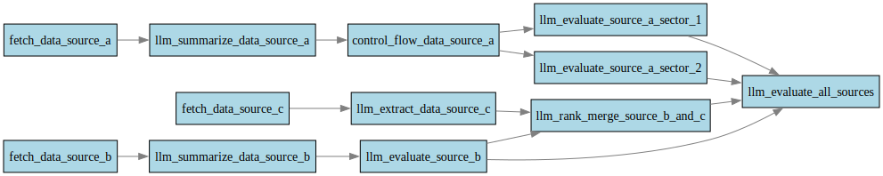

# Asynchronous DAG-based Workflow Orchestrator for LLMs

Note: this is a proof-of-concept prototype.

An asynchronous workflow orchestrator designed to execute LLM-driven tasks in a directed acyclic graph (DAG). This engine interprets workflow definitions from TOML files, resolves task dependencies, and runs LLM or custom functions asynchronously with control flow logic.





Features:

- DAG-based execution: Tasks (nodes) and dependencies (edges) are represented in a directed acyclic graph.

- Asynchronous processing: Leverages Python's asyncio for concurrent task execution.

- LLM integration: Supports nodes that interact with LLMs for processing prompts and generating outputs.

- Custom control flow: Dynamically handles conditional execution and branching logic via control flow nodes.

- TOML workflow configuration: Workflows are defined declaratively in TOML format.

- Graph visualization: Visualize your DAG as an SVG with automatic layout.

# System components
- `workflow.toml` user configuration file to define the DAG workflow
- `node_functions.py` contains the node function primitives as well as custom functions (mainly relating to control flow node types)
- `workflow_dag.svg` generated at run time to visualize the workflow

System outputs are created by the fn `async def execute_dag(dag)` which writes the output of nodes into dict `node_outputs`. The final output will be in the terminal nodes. This essentially allows for multiple outputs to be created in one workflow.

# Running the code 

some weird steps to get graphviz to work on macos
```
brew install graphviz
export CFLAGS="-I$(brew --prefix graphviz)/include"
export LDFLAGS="-L$(brew --prefix graphviz)/lib"
uv pip install pygraphviz
```

running the actual code from the root project directory
```
uv run main.py
```
